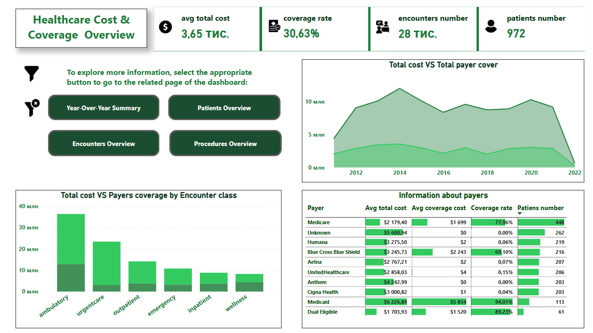
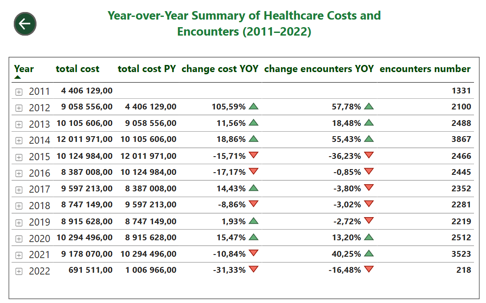
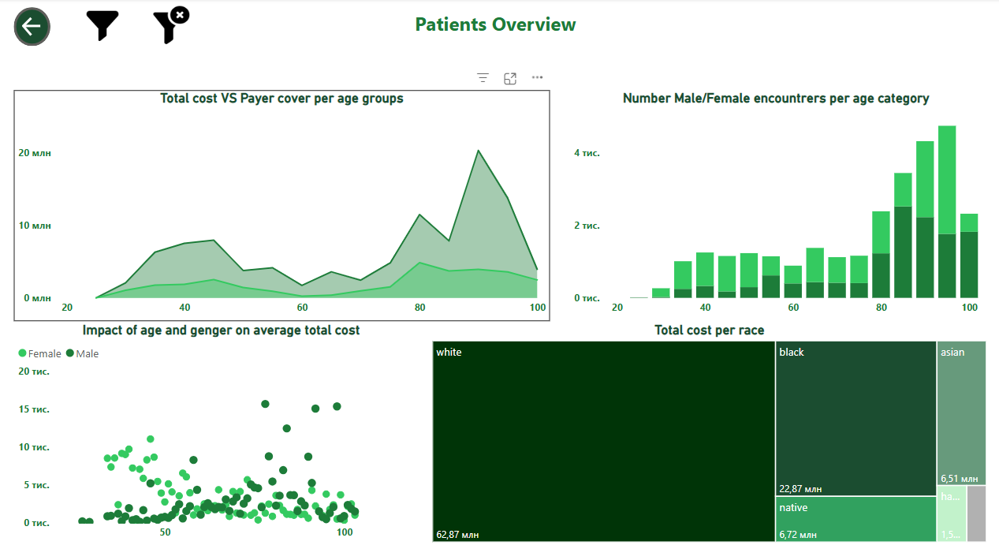
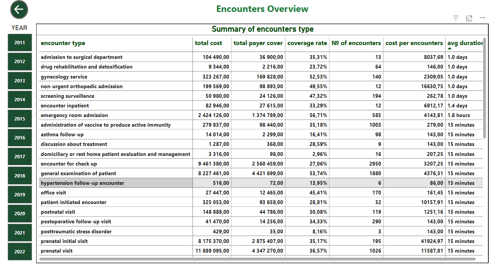
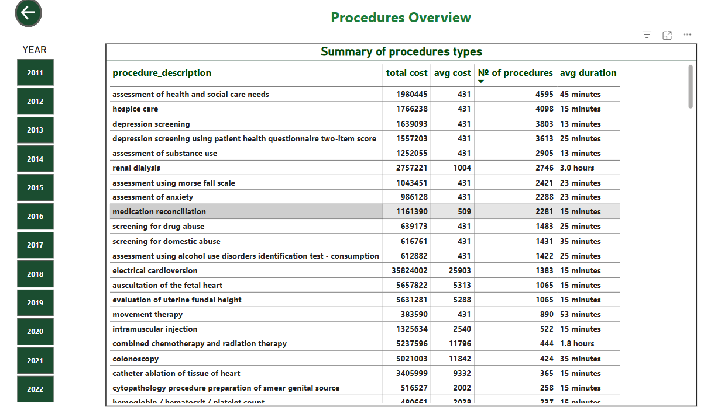

# 📊 Healthcare Cost & Coverage Dashboard Overview

This Power BI project provides a high-level visualization of healthcare costs, patient demographics, and insurance coverage. The dashboard is designed to support interactive exploration of patterns across age groups, gender, race, encounter types, payer categories ets.

## 🔍 Dashboard Highlights

- **Healthcare Cost & Coverage  Overview**:
  
  

- **Year-over-Year Summary**:
  
  

- **Patient Overview**:
  
  

- **Encounters Overview**:
  
  

- **Procedures Overview**:
  
 

- **Navigation Panel**:  
  Allows quick access to different report sections for focused analysis, including patients, encounters, and procedures.

## 📁 Explore the File

### 🔍 Key Interactive Features:
- **Dynamic Filters**: Filter the data by year, gender, age group, race, payer type, and encounter class.
- **Navigation Pane**: Easily switch between multiple report pages including Patients, Encounters, Procedures, and Cost Overview.
- **Tooltips**: Hover over charts and KPIs to see detailed values and contextual information.
- **Responsive Charts**:Most of visuals respond dynamically to user selections, enabling personalized and in-depth exploration.

To fully understand the insights and interact with the visualizations, **please open the Power BI file**. The report allows dynamic filtering and deeper investigation of healthcare patterns.
